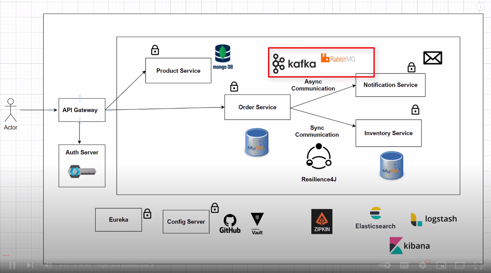
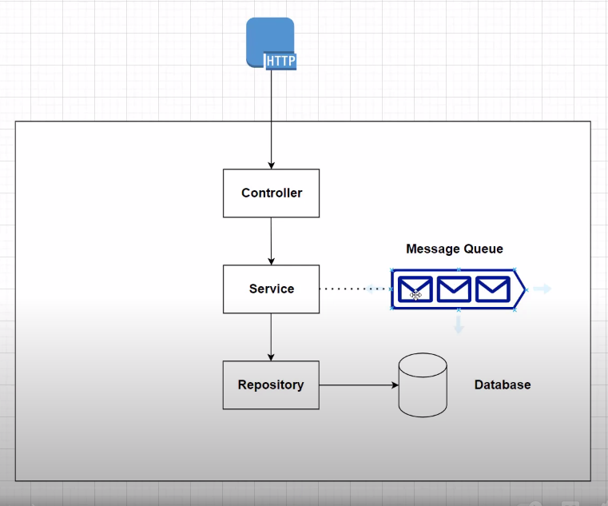

# Ecommerce app

## Overview
A sample app based on [Spring Boot Microservice Project Full Course in 6 Hours](https://www.youtube.com/watch?v=mPPhcU7oWDU)



We use a n-tier architecture to model the app


## Setup
- install a mongo db client
```
sudo apt install mongodb-clients
```

- start infra (mongodb, postgres)
```
cd infrastructure
docker-compose up -d
```

- check that you can connect to mongodb products database and product collection
```
mongo admin -u root -p rootpassword
show dbs
use products
show collections
db.product.find()
```

- create order and inventory databases in postgres using pgAdmin (http://localhost:5050)

## Notes
- for service to service sync communication, we can use RestTemplate or WebClient (webflux) to make HTTP calls
- for service discovery, we can use Spring Cloud Netflix Eureka
- for api gateway, we can use Spring Cloud Gateway. We can use routes, predicates and filters to control the routing

```
## Product Service Route
spring.cloud.gateway.routes[0].id=product-service
spring.cloud.gateway.routes[0].uri=lb://product-service
spring.cloud.gateway.routes[0].predicates[0]=Path=/api/product

## Order Service Route
spring.cloud.gateway.routes[1].id=order-service
spring.cloud.gateway.routes[1].uri=lb://order-service
spring.cloud.gateway.routes[1].predicates[0]=Path=/api/order
```

- for api security, we can use Keyclock

```
spring.security.oauth2.resourceserver.jwt.issuer-uri= http://localhost:8181/realms/spring-boot-microservices-realm
```

- for circuit breaker, we can use Resilience4J. In the /actuator endpoints we can see the state of the circuit breakers, the retries, time limits, etc